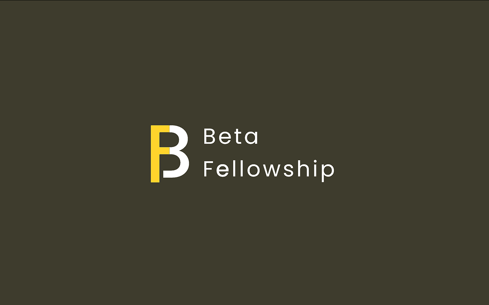

<p align=center>

</p>

This project is a ERC721A Token that uses [OpenZepplin](https://github.com/OpenZeppelin/openzeppelin-solidity).


The contract is compiled and deployed under the ERC-721A upgradable non-fungible token standard with hardhat framework. After deploying onto the Harmony blockchain, users will be able to interacting with the smart contract through DAPP’s front-end interface.

Acquiring NFT:
Users can acquire Beta NFT using Harmony ONE or Fiat Currency through [Beta Fellowship Website](https://betafellow.com/pricing/). This NFT represent the membership of Beta Fellowship community. Each NFT holder will be able to access to the utilities of Beta Fellowship community, include but not limited to education contents, speaker's series with Beta Mentors.

## ERC-721A Token

ERC-721 non-fungible token:
    ERC-721 is a free, open standard that describes how to build non-fungible or unique tokens on the Ethereum blockchain. While most tokens are fungible (every token is the same as every other token), ERC-721 tokens are all unique (with unique ID).

[Reference](https://github.com/ethereum/EIPs/blob/master/EIPS/eip-721.md)

ERC-721A non-fungible token:
    The goal of ERC721A is to provide a fully compliant implementation of IERC721 with significant gas savings for minting multiple NFTs in a single transaction.

[Reference](https://github.com/chiru-labs/ERC721A)

ERC-721A upgradable non-fungible token:
    It is an upgradeable variant of ERC721A, meant for use in upgradeable contracts. It follows all of the rules for Writing Upgradeable Contracts: constructors are replaced by initializer functions, state variables are initialized in initializer functions, and we additionally check for storage incompatibilities across minor versions.

[Reference](https://github.com/chiru-labs/ERC721A-Upgradeable)

## Contracts
You can find contract detail under `contracts/` directory:
- [`BetaTest.sol`](./contracts/BetaTest.sol):
    The implementation of Beta Fellowship ERC721A upgradable smart contract.

## Technical stack

### Frontend(incoming...)
- React
- Web3(MetaMask)
- Web3.js

### UI
- Sass
- Material-UI

### Smart contract/Solidity
- [Hardhat](https://hardhat.org/)

### Test environment
- [Harmony Testnet](https://docs.harmony.one/home/general/wallets/browser-extensions-wallets/metamask-wallet/adding-harmony)

## Requirements

* NodeJS 8.0+ recommended.
* Windows, Linux or Mac OS X.

## How To Install Dependencies

Install required dependencies:

```
npm install
```

Then make sure to add a `.env` file:

```
REACT_APP_ETHERSCAN_KEY='put your etherscan key'
REACT_APP_PRIVATE_KEY='your wallet private key(DON'T SHARE THIS WITH ANYONE!!!'
```

Also, you need to set up your nft picture with [ipfs](https://ipfs.io/)
I recommend using [Pinata](https://www.pinata.cloud/) and here is a tutorial on how to use Pinata for your NFT pictures [Tutorial](https://www.youtube.com/watch?v=fzH7Gjadmj0&t=3308)

## Licence

See [LICENSE](./LICENSE) for details.